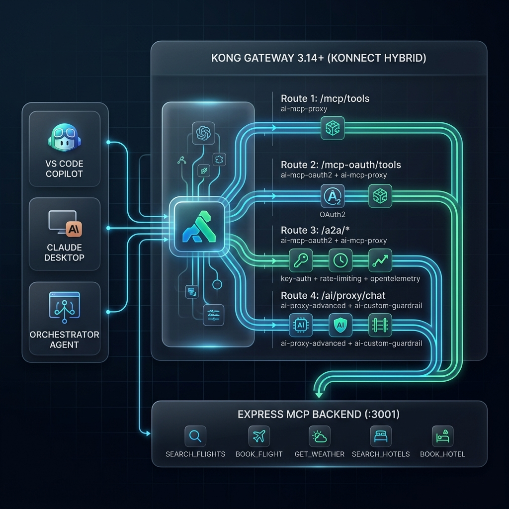

# Kong Agentic AI Bootcamp

A hands-on bootcamp for securing and proxying AI agent traffic with Kong Gateway 3.14+. Four modules covering MCP Proxy, MCP OAuth2, Agent-to-Agent routing, and AI content guardrails.

## What You'll Learn

- Proxy MCP tool calls using all four modes of the `ai-mcp-proxy` plugin
- Secure MCP endpoints with OAuth2 Authorization Code + PKCE via Keycloak
- Route Agent-to-Agent (A2A) calls through Kong with key-auth, rate limits, and OTel tracing
- Block harmful prompts and unsafe LLM responses with `ai-custom-guardrail`
- Deploy on Konnect Hybrid mode (cloud control plane, local Docker data plane)

## Modules

### Module 01 - MCP Proxy

| Lab | Topic | Time |
|-----|-------|------|
| [01-A: Passthrough Listener](module-01-mcp-proxy/labs/01-passthrough-listener.md) | Transparent MCP forwarding through Kong | ~25 min |
| [01-B: Conversion Listener](module-01-mcp-proxy/labs/01-conversion-listener.md) | REST-to-MCP translation at Kong | ~35 min |
| [01-C: Conversion Aggregation](module-01-mcp-proxy/labs/01-conversion-aggregation.md) | Aggregate multiple MCP servers into one listener | ~30 min |

### Module 02 - MCP + OAuth2

| Lab | Topic | Time |
|-----|-------|------|
| [02-A: MCP OAuth2](module-02-mcp-oauth2/labs/02-mcp-oauth2.md) | PKCE-secured MCP with Keycloak, VS Code, and Claude Desktop | ~45 min |

### Module 03 - A2A Agent Routing

| Lab | Topic | Time |
|-----|-------|------|
| [03-A: A2A Routing](module-03-a2a-agents/labs/03-a2a-routing.md) | Agent Card discovery, sub-agent routes, key-auth, per-agent rate limits, OTel | ~40 min |

### Module 04 - AI Custom Guardrail

| Lab | Topic | Time |
|-----|-------|------|
| [04-A: Input Guardrail](module-04-custom-guardrail/labs/04-input-guardrail.md) | Block harmful prompts before the LLM is called | ~25 min |
| [04-B: Output Guardrail](module-04-custom-guardrail/labs/04-output-guardrail.md) | Inspect LLM responses and add audit metrics | ~25 min |

## Prerequisites

- Kong Gateway **3.14+** (Konnect Plus or Enterprise - AI plugins require a licence)
- [Docker](https://www.docker.com/) (local data plane + MCP backend)
- [decK](https://docs.konghq.com/deck/) 1.43+
- [Node.js](https://nodejs.org/) 20 LTS (MCP backend)
- [Keycloak](https://www.keycloak.org/) 24.x (Module 02 OAuth2 lab)

See [prerequisites.md](prerequisites.md) for full setup instructions.

## Getting Started

```bash
# Install dependencies
npm install

# Start the docs site locally
npm run docs:dev
```

The docs site will be available at `http://localhost:5173`.

## Architecture



## Stack

| Component | Technology |
|-----------|-----------|
| Docs site | [VitePress](https://vitepress.dev/) |
| API Gateway | Kong Gateway 3.14+ (Konnect Hybrid) |
| MCP Backend | Express.js (JSON-RPC 2.0) |
| Auth | Keycloak 24.x - OAuth2 Authorization Code + PKCE |

## Resources

- [ai-mcp-proxy plugin](https://developer.konghq.com/plugins/ai-mcp-proxy/)
- [ai-mcp-oauth2 plugin](https://developer.konghq.com/plugins/ai-mcp-oauth2/)
- [ai-custom-guardrail plugin](https://developer.konghq.com/plugins/ai-custom-guardrail/)
- [MCP Specification](https://modelcontextprotocol.io/)
- [Google A2A Specification](https://google.github.io/A2A/)
- [Kong Konnect](https://cloud.konghq.com)

