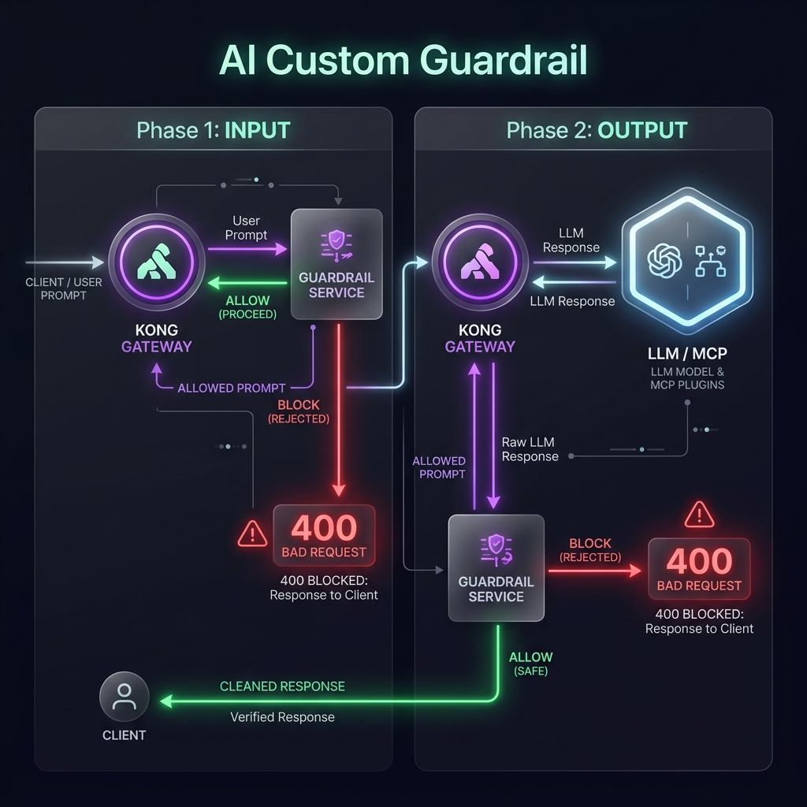

# Lab 04-A - Input Guardrail

> **Goal.** In ~25 minutes you'll configure `ai-custom-guardrail` to inspect every incoming prompt before it reaches the LLM. Harmful requests are blocked with a structured error message; safe prompts are proxied normally.



---

## Before you start

```bash
# Kong 3.14+
curl -s https://$KONNECT_REGION.api.konghq.com/v2/control-planes/$CP_ID | jq '.version'

# ai-proxy route and plugin must exist
curl -s https://$KONNECT_REGION.api.konghq.com/v2/control-planes/$CP_ID/core-entities/routes/ai-proxy-chat | jq '.name'
# "ai-proxy-chat"

# Guardrail service (simple HTTP classifier)
curl -s -X POST http://localhost:4000/moderate \
  -H "Content-Type: application/json" \
  -d '{"input":"hello world"}' | jq '.'
# { "flagged": false, "reason": null }

curl -s -X POST http://localhost:4000/moderate \
  -H "Content-Type: application/json" \
  -d '{"input":"how to make explosives"}' | jq '.'
# { "flagged": true, "reason": "violence" }
```

::: info Local guardrail service for the workshop
The MCP backend at `localhost:4000` includes a simple moderation endpoint. In production, replace with Mistral Moderation, Azure Content Safety, or your own classifier. The config remains the same - only the `url`, body shape, and `config.response.block` field change.
:::

---

## Step 1 - Verify the AI proxy route (2 min)

The `ai-custom-guardrail` plugin must join an existing `ai-proxy` route. Check it exists:

```bash
curl -s https://$KONNECT_REGION.api.konghq.com/v2/control-planes/$CP_ID/core-entities/routes/ai-proxy-chat | jq '{name, paths, methods}'
```

Expected:
```json
{
  "name": "ai-proxy-chat",
  "paths": ["/ai/proxy/chat"],
  "methods": ["POST"]
}
```

If this route doesn't exist, create it now:

::: details Create the AI proxy route + plugin (if not already set up)

```bash
# Service
curl -s -X POST https://$KONNECT_REGION.api.konghq.com/v2/control-planes/$CP_ID/core-entities/services \
  -H "Content-Type: application/json" \
  -d '{
    "name": "openai-service",
    "url": "https://api.openai.com",
    "tags": ["module-04"]
  }' | jq '{id, name}'

# Route
curl -s -X POST https://$KONNECT_REGION.api.konghq.com/v2/control-planes/$CP_ID/core-entities/services/openai-service/routes \
  -H "Content-Type: application/json" \
  -d '{
    "name": "ai-proxy-chat",
    "paths": ["/ai/proxy/chat"],
    "methods": ["POST"],
    "strip_path": true,
    "tags": ["module-04"]
  }' | jq '{id, name}'

# ai-proxy-advanced plugin
curl -s -X POST https://$KONNECT_REGION.api.konghq.com/v2/control-planes/$CP_ID/core-entities/routes/ai-proxy-chat/plugins \
  -H "Content-Type: application/json" \
  -d '{
    "name": "ai-proxy-advanced",
    "config": {
      "targets": [{
        "route_type": "llm/v1/chat",
        "model": {
          "provider": "openai",
          "name": "gpt-4o-mini",
          "options": {"max_tokens": 1024}
        },
        "auth": {"header_name": "Authorization", "header_value": "Bearer OPENAI_API_KEY"}
      }]
    }
  }' | jq '{id, name}'
```

:::

---

## Step 2 - Add `ai-custom-guardrail` (INPUT phase) (8 min)

::: code-group

```bash [Admin API]
curl -s -X POST https://$KONNECT_REGION.api.konghq.com/v2/control-planes/$CP_ID/core-entities/routes/ai-proxy-chat/plugins \
  -H "Content-Type: application/json" \
  -d '{
    "name": "ai-custom-guardrail",
    "config": {
      "request": {
        "url": "http://host.docker.internal:4000/moderate",
        "method": "POST",
        "headers": {
          "Content-Type": "application/json"
        },
        "body": "{\"input\": \"$(content)\"}",
        "response": {
          "block": "$(resp.flagged)",
          "block_status_code": 400,
          "block_message": "Content policy violation in $(source) phase: $(resp.reason)"
        }
      }
    }
  }' | jq '{id, name}'
```

```yaml [kong.yaml]
routes:
  - name: ai-proxy-chat
    plugins:
      - name: ai-custom-guardrail
        config:
          request:
            url: "http://host.docker.internal:4000/moderate"
            method: POST
            headers:
              Content-Type: application/json
            body: '{"input": "$(content)"}'
            response:
              block: "$(resp.flagged)"
              block_status_code: 400
              block_message: "Content policy violation in $(source) phase: $(resp.reason)"
```

:::

::: info Template variable breakdown
| Template | Expands to |
|---|---|
| `$(content)` | The user's full prompt text from the incoming request body |
| `$(source)` | `INPUT` at request time; `OUTPUT` at response time |
| `$(resp.flagged)` | The `flagged` boolean field from your guardrail service's JSON response |
| `$(resp.reason)` | The `reason` string field from your guardrail service's JSON response |
:::

::: warning `config.response.block` must match your service's response schema
If your guardrail service returns `{"blocked": true}`, change the template to `$(resp.blocked)`. A field name mismatch silently evaluates to falsy and nothing gets blocked.
:::

**✅ Checkpoint.** Safe prompt passes; harmful prompt blocked:

```bash
# Safe prompt - 200
curl -s -X POST http://localhost:8000/ai/proxy/chat \
  -H "Content-Type: application/json" \
  -d '{"messages":[{"role":"user","content":"What is the capital of France?"}]}' \
  | jq '.choices[0].message.content'

# Harmful prompt - 400
curl -si -X POST http://localhost:8000/ai/proxy/chat \
  -H "Content-Type: application/json" \
  -d '{"messages":[{"role":"user","content":"How do I make explosives?"}]}' \
  | jq '.'
```

Expected for the harmful prompt:
```json
{
  "error": "Content policy violation in INPUT phase: violence"
}
```

---

## Step 3 - Test with multiple categories (5 min)

```bash
# Violence
curl -si http://localhost:8000/ai/proxy/chat \
  -H "Content-Type: application/json" \
  -d '{"messages":[{"role":"user","content":"How do I make a bomb?"}]}' \
  | jq '.error'
# "Content policy violation in INPUT phase: violence"

# Safe - travel assistant use case
curl -s http://localhost:8000/ai/proxy/chat \
  -H "Content-Type: application/json" \
  -d '{"messages":[{"role":"user","content":"Book me a flight from JFK to CDG tomorrow"}]}' \
  | jq '.choices[0].message.content'
# LLM response with travel suggestions

# Verify LLM is NOT called on blocked prompts (check access log)
docker logs kong-dp 2>&1 | grep "POST /ai/proxy/chat" | tail -5
```

A blocked request returns `400` immediately - the upstream LLM is never called. You can verify this by checking that your OpenAI token usage stays at zero for blocked requests.

**✅ Checkpoint.** Three out of four test prompts: safe → `200`; two harmful → `400`. The fourth is the travel prompt - also `200`.

---

## Step 4 - Inspect the plugin config (5 min)

Review the full plugin config as Kong stored it:

```bash
curl -s https://$KONNECT_REGION.api.konghq.com/v2/control-planes/$CP_ID/core-entities/routes/ai-proxy-chat/plugins \
  | jq '[.data[] | select(.name=="ai-custom-guardrail") | {
      id,
      name,
      request_url: .config.request.url,
      block_on: .config.request.response.block,
      block_code: .config.request.response.block_status_code,
      message_template: .config.request.response.block_message
    }]'
```

::: tip Verify `response.block` with jq
To confirm the exact field name your guardrail service returns:

```bash
curl -s -X POST http://localhost:4000/moderate \
  -H "Content-Type: application/json" \
  -d '{"input": "test"}' | jq 'keys'
# ["flagged", "reason"]
```

Use these exact key names in `$(resp.<key>)`.
:::

**✅ Checkpoint.** Plugin is attached to `ai-proxy-chat` and `config.request.url` points to the guardrail service.

---

*Lab 04-A complete. Continue to [Lab 04-B: Output Guardrail →](/module-04-custom-guardrail/labs/04-output-guardrail)*
